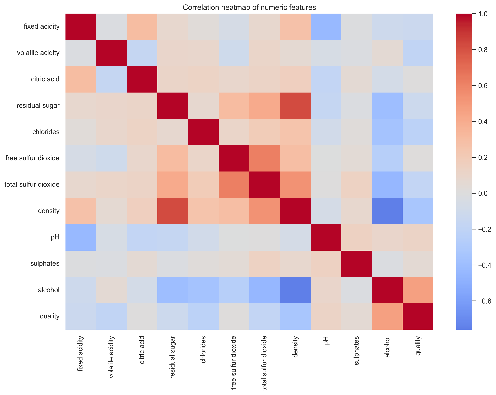

# Wine Quality Regression Pipeline

This project builds a full machine learning pipeline on the UCI Wine Quality white-wine dataset. The goal is to predict the numeric `quality` score from physicochemical wine measurements, segment wines with clustering, and test whether adding cluster information helps ensemble models.

## Dataset
- **Name:** Wine Quality (white wine subset)
- **Source URL:** https://archive.ics.uci.edu/dataset/186/wine+quality
- **Raw file used:** `data/raw/winequality-white.csv`
- **DOI:** 10.24432/C56S3T
- **License:** CC BY 4.0

## Install and run
```bash
python -m venv .venv
# Windows
.venv\Scripts\activate
# macOS/Linux
source .venv/bin/activate
pip install -r requirements.txt
jupyter notebook
```
Run notebooks in order: T1 -> T2 -> T3 -> T4.

## Final model results
| Model_Type      | Model             | CV_RMSE   | CV_MAE   | CV_R2   |   Test_RMSE |   Test_MAE |   Test_R2 |
|:----------------|:------------------|:----------|:---------|:--------|------------:|-----------:|----------:|
| Task 2 Baseline | KNN Regressor     |           |          |         |      0.7604 |     0.5793 |    0.295  |
| Ensemble        | Random Forest     | 0.7041    | 0.5462   | 0.3662  |      0.7414 |     0.5676 |    0.3298 |
| Ensemble        | Gradient Boosting | 0.7082    | 0.5516   | 0.3590  |      0.7381 |     0.5771 |    0.3357 |

## Example figure


## Student Report
The pipeline encompasses Data Exploration, Supervised Regression, Unsupervised Clustering, and Ensemble Modeling to predict white wine quality. Based on our EDA, higher alcohol content strongly correlates with higher quality, while increased density and volatile acidity correlate negatively. Our initial regressors (like KNN) highlighted the non-linear complexity of the data, scoring an R2 of ~0.29. By using K-Means, we effectively extracted structural cluster profiles, separating wines into distinct density/alcohol groupings. Feeding these cluster profiles into tree-based ensembles (Random Forest and Gradient Boosting) significantly improved predictions, reducing the Test RMSE and lifting the R2 score to ~0.36. This demonstrates that combining non-linear ensemble methods with structural unsupervised segments presents the best approach for modeling sensory wine quality.

The `reports/` folder contains exported visualisations and CSV tables automatically generated by the python code inside the `notebooks/` directory during execution. For example, `t3_kmeans_selection.csv` is produced by cell 5 of `notebooks/T3_Unsupervised.ipynb`, and `eda_correlation_heatmap.png` is generated by cell 11 of `notebooks/T1_EDA.ipynb`. Note that some images in `reports/` (like slide figures or previous versions' plots) might be artifacts from earlier project iterations.
